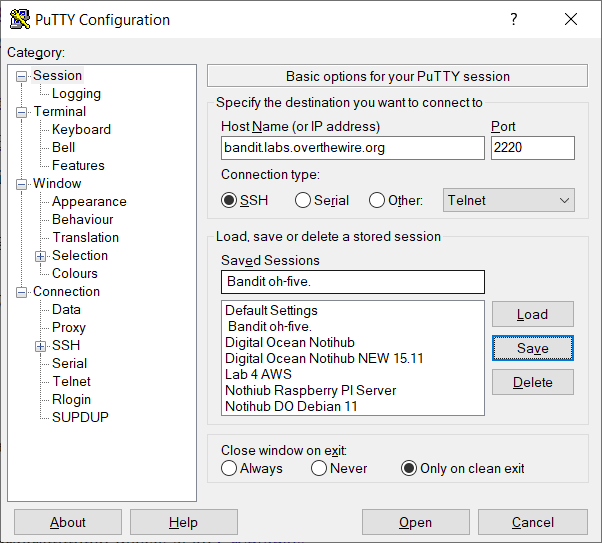
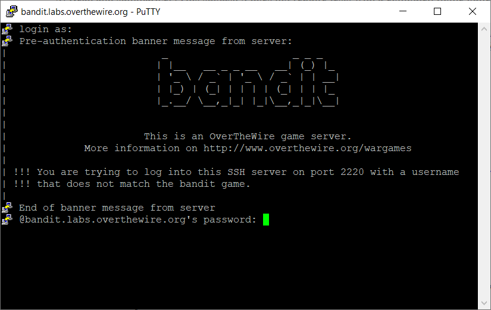
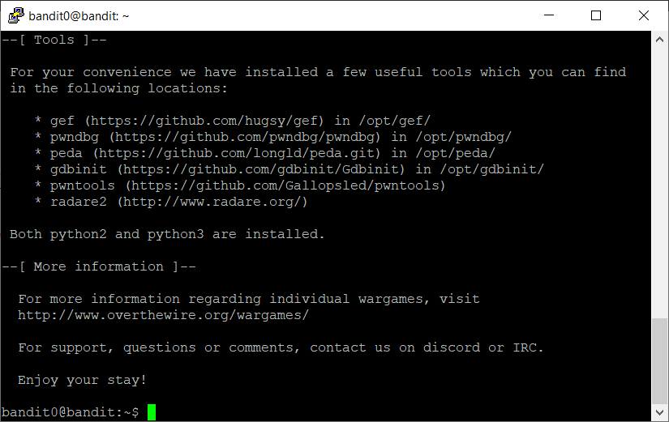
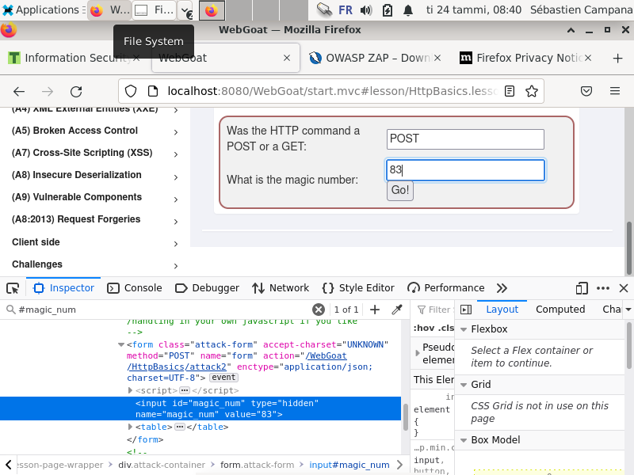

# Homework H1 First steps

## 0) Sumarize
## Article Hutchins et al 2011: Intelligence-Driven Computer Network Defense Informed by Analysis of Adversary Campaigns and Intrusion Kill Chains
[Link to the full article](HH_Information_Security_Course_2023\Homeworks\h1\LM-White-Paper-Intel-Driven-Defense.pdf "PDF document")

### Summary

This article deals with 

+ The Cyber Kill Chain® 

The Cyberspace Kill Chain or Intrusion Kill Chain is a model developed by the american company Lockhead Martin Corp. This company is working in the fields of information security, defence and aerospace, among others 
The chain contains 7 links:
 1. Reconnaissance
 2. Weaponization
 3. Delivery
 4. Exploitation
 5. Installation
 6. C2: Command & Control
 7. Actions on objectives

 Because any one flaw may cause the entire process to be interrupted, this integrated, end-to-end process is referred to as a "chain."


Cyber Kill Chain® schema, www.lockheedmartin.com

+ APT: Adavanced Persistente Thereat
+

## Karvinen 2020: Command Line Basics Revisited

+ They are some group of commands such as:
    - Moving and looking around (```ls, cd```)
    - File Manipulation (```nano. cat, mkdir, mv, cp, rmdir, rm```)
    - SSH Remote Control (```ssh, scp -r```)
    - Package Management/Installing Software (```apt-get update/install```)

For each single command we can get its help with adding ```--help``` or ```-h``` at the end
Example ```ls --help```
We can also get the manual with the command man followed by the name of the command

Important directories are:
+ /home
+ /etc/
+ /media/
+ /var/log


## a) Bandit oh-five. Solve Over The Wire: Bandit the first five levels (0-4).

### Level 0

I connected with Putty to the host bandit.labs.overthewire.org on the port 2220 with the provided username and same password: bandit0






### Level 1
I listed all the files with the command ls
And the opened the file readme with cat to find the password for the next level: NH2SXQwcBdpmTEzi3bvBHMM9H66vVXjL

### Level 2
cat < -
rRGizSaX8Mk1RTb1CNQoXTcYZWU6lgzi

### Level 3
Logeed-in with bandit2

cat "spaces in this filename"
aBZ0W5EmUfAf7kHTQeOwd8bauFJ2lAiG

### Level 4
Logged-in with bandit3
cd inhere
ls -a (-a to see hidden file)
cat .hidden
2EW7BBsr6aMMoJ2HjW067dm8EgX26xNe

## b) Bullseye. Install Debian 11-Bullseye virtual machine in VirtualBox.

I installed Debian on a VirtualBox machine following Tero Karvinen tutorial (2021): https://terokarvinen.com/2021/install-debian-on-virtualbox/

## c) WebGoat. Install WebGoat practice target. 
I installed WebGoat on my brand new Virtual Debian machine following Tero Karvinen tutorial (2020):
https://terokarvinen.com/2020/install-webgoat-web-pentest-practice-target/

## d) Hacker warmup. Solve these tasks on WebGoat

### General: HTTP Basics
The first task was to find if the request after submiting the form was an POST or GET HTTP request.

I openned the Developer Tools of my browseer (Inspector) and saw that it was a POST

Also the magic number was in hidden an input.




### General: Developer tools

#### ZAP Installation
I had first to install ZAP Proxy.
I follewed a tutorial on YouTube : https://www.youtube.com/watch?v=a6_TprVx7LE

And the documention of ZAP (getting-sarted): https://www.zaproxy.org/getting-started/

Then I was stuck