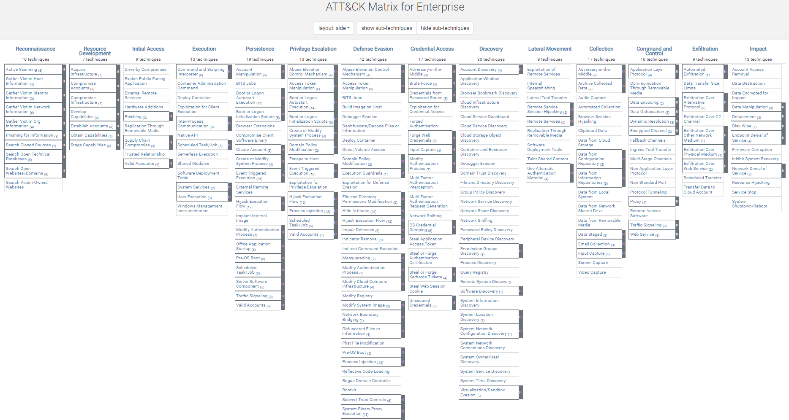
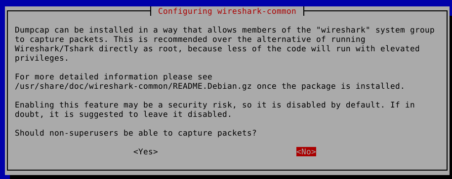
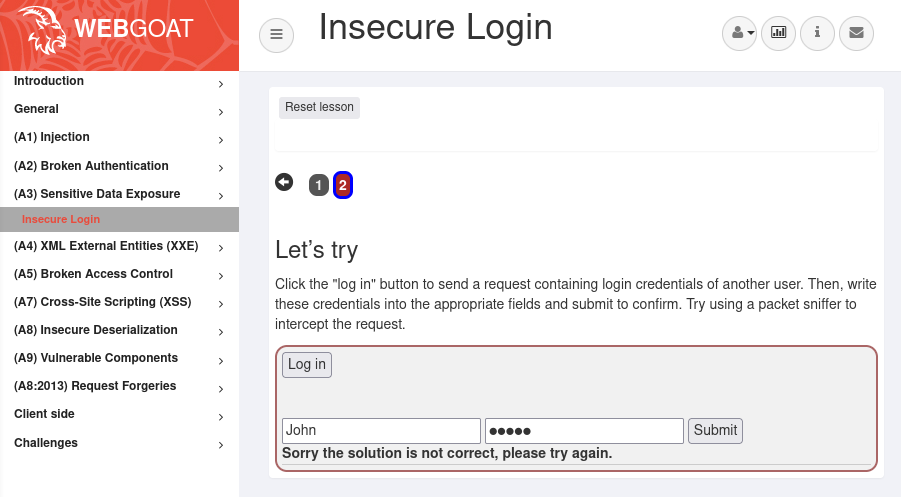
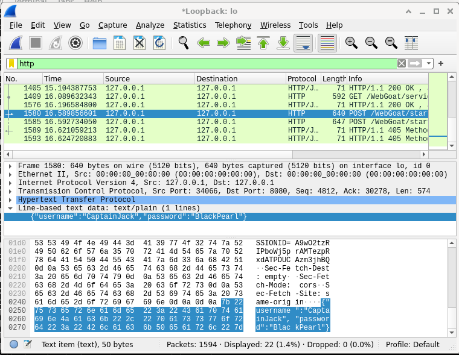
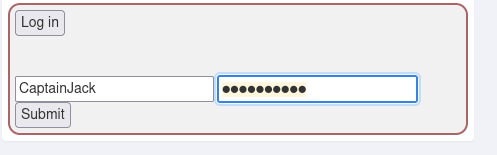
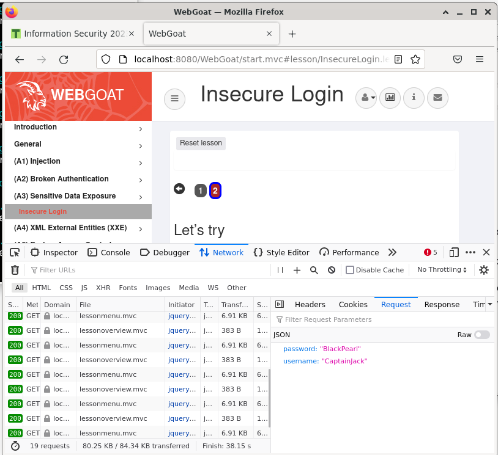

# Homework H3 Attaaack
See instructions: https://terokarvinen.com/2023/information-security-2023/


## x) € Costa-Gazcón 2021: Practical Threat Intelligence and Data-Driven Threat Hunting Chapter 4: Mapping the Adversary

[Full article on O'Reilly](https://learning.oreilly.com/library/view/practical-threat-intelligence/9781838556372/B13376_04_Final_SK_ePub.xhtml#_idParaDest-75 "Hypertext link")

+ _Practical Threat Intelligence and Data-Driven Threat Hunting_ is a book that offers guidance on how to gather and analyze data to identify cyberthreats and respond to them.

### ATT&CK Framework

Developed by MIRE Corporation
"The ATT&CK Framework is a descriptive model used to label and study the activities that a threat actor is capable of carrying out in order to get a foothold and operate inside an enterprise environment, a cloud environment, smartphones, or even industrial control systems." (Valentina Costa-Gascón, 2020)


[](https://attack.mitre.org/#) 
_ATT&CK Entreprise Matrix (some technique for Defense Evasion are missiing)_

### Tactics
As show in the Matix above, the techniques are separeted into 14 tactics:
+ **Reconnaissance:** The aim is to gather as much information as possible about the victim.
+ **Resource Development:** methods aims to assess the enemy's resources. Resources used by the opponent can be bought, stolen or developed.
+ **Initial Access:**
methods that attackers employ to access a target machine or network.
+ **Execution:** methods for installing malicious software on a target system.
+ **Persistence:** techniques used by attackers to stay active on a target system after gaining initial access.
+ **Privilege Escalation:** methods for gaining privileged access to a target system.
+ **Defense Evasion:** methods for avoiding detection and avoiding getting caught by security measures.
+ **Credential Access:** methods for stealing or obtaining legitimate login credentials for a target system or network.
+ **Discovery:** methods for learning more about a target network or system.
+ **Lateral Movement:** Techniques for moving laterally within a target system or network are referred to as "lateral movement."
+ **Collection:** methods for obtaining data from a target network or system.
+ **Command and Control:** Techniques used to communicate with and control malware on a target system.
+ **Exfiltration:** Techniques used to remove data from a target system or network.
+ **Impact:** Techniques used to cause harm or disruption to a target system or network.

### ATT&CK Navigator
The ATT&CK Navigator is a tool developed by MITRE Corporation to help organizations understand the Adversarial Tactics, Techniques, and Common Knowledge (ATT&CK) framework.
It is a graphical interface that allows users to interact with the framework and understand how various tactics, techniques, and procedures are used in real-world attacks.
It is a valuable resource for security professionals and organizations looking to improve their security posture and better understand the tactics used by cyber adversaries.

### FormBook

**What is it?**

A FormBook Malware is an infostealer malware. It was discovered for the first time in 2016.

It is a type of malware that can be used to steal sensitive information from infected systems. This malware is typically distributed through phishing emails, malicious software downloads, and exploit kits. Once installed, FormBook can run in the background on an infected system and capture information through keylogging, form grabbing, and other methods. The malware can then send this information back to the attacker for further use. FormBook is considered a serious threat as it can be used to steal sensitive information and compromise the security of infected systems. It is important for individuals and organizations to take steps to protect themselves from FormBook and other types of malware, such as implementing security measures, being cautious when opening emails or downloading software, and keeping software and systems up to date.

Sources: 
+ [FormBook, checkpoint.com](https://www.checkpoint.com/cyber-hub/threat-prevention/what-is-malware/what-is-formbook-malware/) 
+ [Inside Formbook Infostealer by the malware researcher Gabriela Nicolao, 2018](https://www.virusbulletin.com/uploads/pdf/magazine/2018/VB2018-Nicolao.pdf)

## y) 

### Define tactic and give an example.

Tactic is a word used to describe a way someone is trying to achieve something. Cyber adversaries use tactics to achieve their goals in a cyber attack. The ATT&CK framework provides a way to understand all the different tactics used by cyber adversaries, so we can protect ourself from these attacks.

It is a set of techniques and procedures used by someone who opposes you in an attempt to gain an advantage. The ATTACK framework currently includes 14 tactics as explained [above](#tactics), which cover different stages in the attack life cycle.

### Define technique and subtechnique, and give an example of each.

Techniques are things that adversaries use in order to get what they want. Sub-techniques are smaller versions of techniques, which can be used to help get specific goals accomplished. Tactics are the ways in which adversaries use techniques and sub-techniques to get their objectives.

Examples:
+ Techinque:
**Phising (T1566)** Phishing is a technique used to obtain sensitive information, such as passwords or financial data, by tricking individuals into revealing this information through a fake or malicious email.
+ Subtechnique:
**Spearphishing Attachment (T1566.001)** Sent through an email, an comprissed Microsoft File (for example .docx Word document) containing a macro that it's use for phsiing

### Define procedure, and give an example of each.
An adversary's use of a particular step or series of steps to carry out a technique or sub-technique is referred to as a procedure. Procedures are used to describe the precise steps an adversary takes to put a technique into practice and accomplish their objectives. 

Example: 
Control and command (C2) Communication is the process by which an adversary's malware and a command and control server establish and maintain contact in order for the malware to receive commands and exfiltrate data.

### References:
+ [Mitre Att&CK](https://attack.mitre.org/)
+ [The Top Ten MITRE ATT&CK Techniques](https://www.picussecurity.com/resource/the-top-ten-mitre-attck-techniques)
+ [MITRE ATT&CK framework techniques, sub-techniques & procedures](https://resources.infosecinstitute.com/topic/mitre-attck-framework-techniques-sub-techniques-procedures-an-overview/)
+ https://attack.mitre.org/techniques/T1566/
+ https://attack.mitre.org/techniques/T1566/001/

## a) Webgoat: A3 Sensitive data exposure

### Insecure Login: 2 Let's try

Started my WebGoat server (installed the previous week) with the following command:
```
java -jar webgoat-server-8.0.0.M26.jar
```


I first installed WireShark. It is a free and open-source packat analyzer.

`sudo apt update`

`sudo apt install wireshark -y`

Don't allow superusers to capture packets because it is a security risk

 

I openned WireShark as an admin

`sudo wireshark`

I applied an _http_ filter so I can focus on what I capture.

Then I clicked on the blue shark fin button to start capturing packets 

On webgoat, I entered random value for username and password in the log-in form. And the clicked "Log in"

 

On WireShark I stoped capturing packets a few seconds later.

Then I found a POST http packet "POST /WebGoat/start.mvc HTTP/1.1"

In the detals we can see that a the usernme _CaptainJack_ and the password _BlackPearl_ are sent as plain text because the form isn't using  HTTPs 

 

Then I logged with the credentials I found in the unsecure http request.


 

Actually I realised later that I didn't need to use WireShark for this exercice. I could just have use the Developers Tools of Firefox by looking in the Network tab, we can see also the packets sent and received.

 