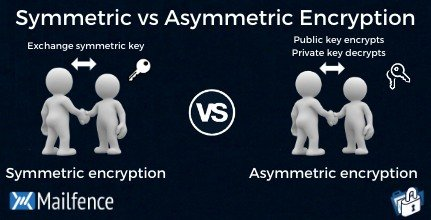

# Homework H3 Hash
See instructions: https://terokarvinen.com/2023/information-security-2023/

## x) Read and summarize € Schneier 2015: Applied Cryptography: 10. Using Algorigthms: 10.1, 10.2, 10.3, 10.4 (from start until the start of "Dereferencing Keys" in 10.4)
[Full article on O'Reilly](https://learning.oreilly.com/library/view/applied-cryptography-protocols/9781119096726/19_chap10.html#chap10 "Hypertext link")

### Chapter 10 Using Algorithms

Cryptography is use in system such as
+ bank cards
+ pay-TV
+ road tolls
+ office building and computer access tokens
+ lottery terminals and prepayment electricity meters

Most of the failures are because of they did wrong in the implementation not because of the algorithms itself

### 10.1 CHOOSING AN ALGORITHM

There is 5 ways to choose a cryptohraphy algorithm

+ published algorithm
+ manufacturer algorithm
+ ask help to a private consultant
+ trust a government
+ if you are really skilfull, write your own algorithms

### 10.2 PUBLIC-KEY CRYPTOGRAPHY VERSUS SYMMETRIC CRYPTOGRAPHY

There is no reason to compare both of them. They are like different sort of animal.

Cryptography suit the best for **encrypting data** whereas public-key cryptography is for **key management and cryptographic protocols** such as:
+ SSL/TLS
+ PGP (Pretty Good Privacy)
+ IPSec
+ Kerberos
+ SSH

 
https://blog.mailfence.com/symmetric-vs-asymmetric-encryption/

### 10.3 ENCRYPTING COMMUNICATIONS CHANNELS

There is two different approcahes to secure data transmission in a IT network

**Link-by-Link Encryption**

Method that encrypts data as it moves from one network node to another. Only the nodes at either end of a link can  decode the data since each link between nodes is encrypted or its own. Although this method offers protection from attacks that take place between nodes, it does not offer end-to-end security. A hacker who gets access to a network node may be able to intercept or change the data. 

**End-to-End Encryption**

On the other hand, end-to-end encryption is a method that encrypts data at the source and holds it until it reaches its destination. No other node in the network can decrypt the data as it is encrypted by the sender and decrypted by the receiver.y
Because the data is safeguarded even if a network node is hacked, this strategy offers higher security.

Link-by-link encryption protects against attacks that occur between nodes, but end-to-end encryption offers better protection against attacks that occur throughout the network. The level of security required and the type of network used will determine which strategy to employ. Link-by-link encryption may be adequate for the transfer of less sensitive data, such as web browsing, while end-to-end encryption is frequently used for the transmission of sensitive data, such as in online banking or messaging services.

### 10.4 ENCRYPTING DATA FOR STORAGE

+ Driver-Level vs. File-Level Encryption

## y) Choose a password manager. Explain:

My Choice: KeyPass 2

### What treaths does it protect against?

It protect against brut force attack with weak-passwords. Also it protect password reuse. We can have different password for each services/website. So if one website got hacked our others account are not leaked

### What information is encrypted, what's not?

The password are.
The usernames, e-mails and notes aren't

###  What's the license? How would you describe license's effects or categorize it?

KeePass 2 is released under the Open Source GPL (General Public License) version 2.0.

### Where is the data stored? If in "the cloud", which country / juristiction / which companies? If on local disk, where?

By default, locally on the user's computer. But he can also choose the store the master database on it's third-pary cloud services such as Dropbox, OneDrive or google Drive.  the data will be stored on the servers of those companies in the countries and jurisdictions where those servers are located.

###  How is the data protected?

+ With encrypetion (AES)
+ Master password
+ MFA (Two factor authentifaction)
+ Auto-lock of the databse
+ Clipboard security. If we copy a password. It's delete automatically after some seconds/minutes)

## a) Demonstrate the use of a password manager.

## b) Encrypt and decrypt a message (you can use any tool you want, gpg is one option)